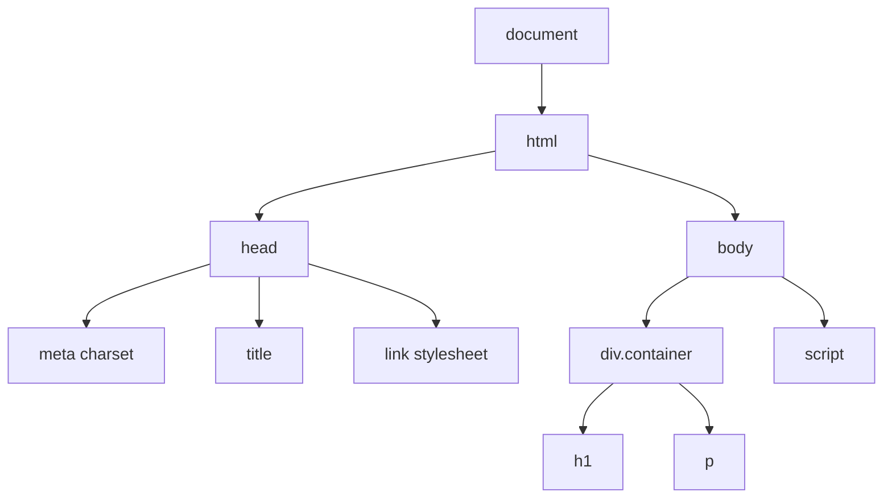

# Web Front End Lecture Notes
These lecture notes describe:
1. setting up a development environment and project structure
2. providing an overview of HTML, CSS, and JavaScript, including Node.JS, npm, Vite

In the following weeks, we'll introduce SVG and Canvas.


# Development Environment
## Setup
1. IDE -- [VSCode](https://code.visualstudio.com/download)
2. Use shell to install [Node.js](https://nodejs.org/en/download)
3. Verify installation by checking version of npm `npm --version`

## GitHub and Terminal
1. Create a GitHub.com account [here](https://github.com/)
2. Create new repo titled `5588_00_intro_repo`
3. Open VSCode > View > Terminal
4. Confirm you have git installed by typing 'git -version'
5. In terminal navigate to your class folder on your computer using `ls` or `dir` to see directory contents, and `cd` to change directories. `mkdir <name>` creates a new folder.
6. Clone the repo with `git clone <insert web address ending in .git` accessed on repo main page

## Project Structure
In that cloned repo, setup your project structure with empty files for now. Use VSCode Explorer to create files and folders.
```
Project folder
├── css
│   └── main.css 
├── data
│   └── data.csv
├── js
│   └── main.js
└── index.html
```

## Hello World HTML and Web Inspector

In your `index.html` paste the following and then open it:
```
<!DOCTYPE html>
<!-- Basic HTML template -->
<html lang="en">
<head>
    <meta charset="UTF-8">
    <title>Title</title>
    <link rel="stylesheet" href="css/main.css">
</head>
<body>
    <div class="container">
        <h1>Heading</h1>
        <p>Content</p>
    </div>
    <script src="js/main.js"></script>
</body>
</html>
```

We'll use this simple file to discuss
1. The document object model (DOM). This is illustrated below in Figure 1. See [here](https://developer.mozilla.org/en-US/docs/Web/API/Document_Object_Model) for docs.
2. Web Inspector.
3. Browser security and the need for a local web server for development.
4. DOM manipulation as essential for geovis.

**Figure 1.** Illustration of the document object model for the simple HTML above. We use JavaScript to update the DOM programmatically.

## Convert Folder into a Node.js project

1. In VSCode terminal, navigate to folder.
2. Run `npm init -y`
3. Verify that a new file was created titled `package.json`
4. Install vite with `npm install vite` (more on vite [here](https://www.npmjs.com/package/vite))


## Local Web Server

1. Update `package.json` to work with vite.
```
        ...
          "scripts": {
            "dev": "vite",
            "build": "vite build"
          },
        ...
```
2. In the terminal run `npm run dev`. Node Package Manager (npm) will look at package.json, see `"dev":"vite"` and run the site with vite.

At this point, you should have had a browser open and your page should be displaying.

## Cascading Style Sheets (CSS)

1. In VSCode, open main.css.
2. Add this to the file and save.
```
/* Main styles */
h1 {
    color: blue;
}
```

We'll take time in class to play with this. Learn more about CSS [here](https://developer.mozilla.org/en-US/docs/Web/CSS).

## JavaScript
1. In VSCode, open `main.js`, and paste > save the below. 

```
// Create new div
const newDiv = document.createElement('div');
newDiv.className = 'new-content';
newDiv.textContent = 'Added dynamically';

// Add to container
const container = document.querySelector('.container');
container.appendChild(newDiv);
```


## On Your Own
Use JavaScript to create a website that introduces yourself.
