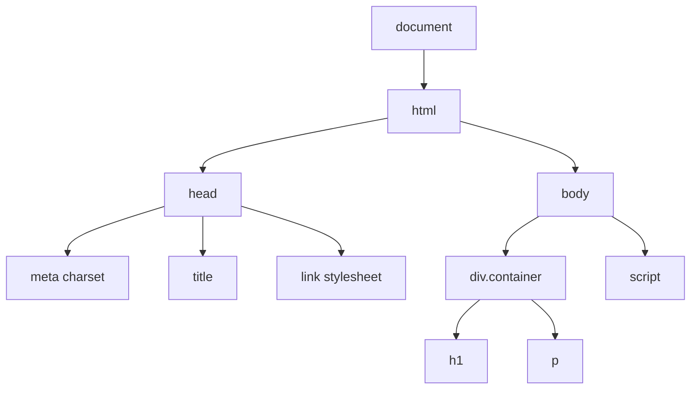

# Web Front End Lecture Notes
These lecture notes describe:
1. setting up a development environment and project structure
2. providing an overview of HTML, CSS, and JavaScript, including Node.JS, npm, Vite
3. SVG and HTML Canvas


# Development Environment
## Setup
1. IDE -- [VSCode](https://code.visualstudio.com/download)
2. Use shell to install [Node.js](https://nodejs.org/en/download)
3. Use npm to install other dependencies: ```npm install <PACKAGE>```

## GitHub and Terminal
1. Create a GitHub.com account [here](https://github.com/)
2. Create new repo titled `5588_00_intro_repo`
3. Open VSCode > View > Terminal
4. Confirm you have git installed by typing 'git -version'
5. In terminal navigate to your class folder on your computer using `ls` or `dir` to see directory contents, and `cd` to change directories
6. Clone the repo with `git clone <insert web address ending in .git` accessed on repo main page

## Project Structure
In that cloned repo, setup your project structure with empty files for now. Use VSCode Explorer to create files and folders.
```
Project folder
├── css
│   └── main.css 
├── data
│   └── data.csv
├── js
│   └── main.js
└── index.html
```

## Hello World HTML and Web Inspector

In your `index.html` paste the following and then open it:
```
<!DOCTYPE html>
<!-- Basic HTML template -->
<html lang="en">
<head>
    <meta charset="UTF-8">
    <title>Title</title>
    <link rel="stylesheet" href="css/main.css">
</head>
<body>
    <div class="container">
        <h1>Heading</h1>
        <p>Content</p>
    </div>
    <script src="js/main.js"></script>
</body>
</html>
```

We'll use this simple file to discuss
1. The document object model (DOM). This is illustrated below in Figure 1. See [here](https://developer.mozilla.org/en-US/docs/Web/API/Document_Object_Model) for docs.
2. Web Inspector.
3. Browser security and the need for a local web server for development.

**Figure 1.** Illustration of the document object model for the simple HTML above.



## Local Web Server
